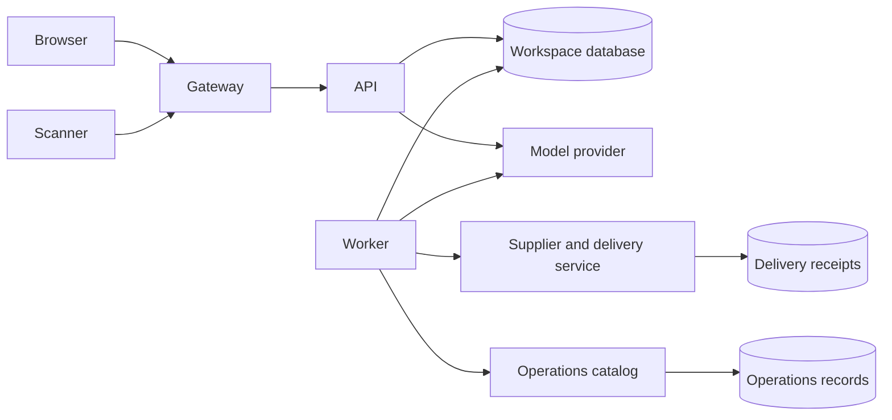

# Application architecture

Meridian models a research team's lifecycle: intake → indexing → retrieval →
assistant reasoning → approved report execution → artifact delivery.

## Runtime services

| Service | Responsibility | Storage |
|---|---|---|
| gateway | HTTP edge, size limits, proxy headers | none |
| api | Sessions, memberships, library, conversations, workflow management | workspace volume |
| worker | Scheduled exports, source imports, workflow execution | workspace volume |
| model | OpenAI-compatible local completion provider | none |
| connector | Research supplier feeds, feed relocation, report receipts | connector-data volume |
| vault | Internal continuity catalog | vault-data volume |
| initialize | One-shot schema and sample-data initialization | workspace volume |

The internal `services` network supplies Docker DNS names. The gateway also joins
an ingress network. API, worker, and auxiliary services have no published ports.
Processes run as non-root users, with read-only root filesystems, dropped Linux
capabilities, and separate writable volumes. No real cloud metadata endpoint is used.

## Data model

SQLite WAL provides a shared transactional application store for this single-host
deployment. It is not a simulation of a distributed database. The application has
separate tables for workspaces, users, memberships, sessions, collections, documents,
chunks, the FTS index, retrieval cache, sources, hook receipts, workflow revisions,
jobs, artifacts, conversations, messages, and audit events.

Documents are indexed in overlapping chunks. Retrieval normalizes search terms,
uses FTS ranking, and caches matching chunk identifiers for two minutes. Document
mutations invalidate cached retrieval results. Conversations retain questions,
answers, source citations, and tool execution counts.

Workflows contain a collect stage, optional summarization stages, and one publish
stage. Approval records store the approving identity and a plan digest. Jobs use
transactional queue claims and support delayed starts and cancellation before
execution. Artifacts persist the generated report rather than regenerating it on
download. Share links bind an artifact, workspace, and expiration time to an HMAC.

## Access model

Viewers read team records and use the assistant. Analysts maintain team records,
create sources, prepare workflows, and export permitted collections. Administrators
manage restricted collections, approve workflows, and change membership roles.
Resource identifiers are separate from authorization decisions. Each API request
resolves the active workspace membership from its session identity.

Source previews produce signed delivery envelopes for connector onboarding. Hook
receipts provide replay tracking. Imported content becomes a document in the source's
configured collection, with metadata retained for citations and action cards.

## Operational limits

This is a single-host application, not a highly available production service. It
does not include billing, enterprise SSO, distributed queue leases, or automatic
job retries. The local model uses deterministic extraction and action-card handling,
not neural inference. These boundaries keep the complete application launchable
without external accounts or model expenditure.
